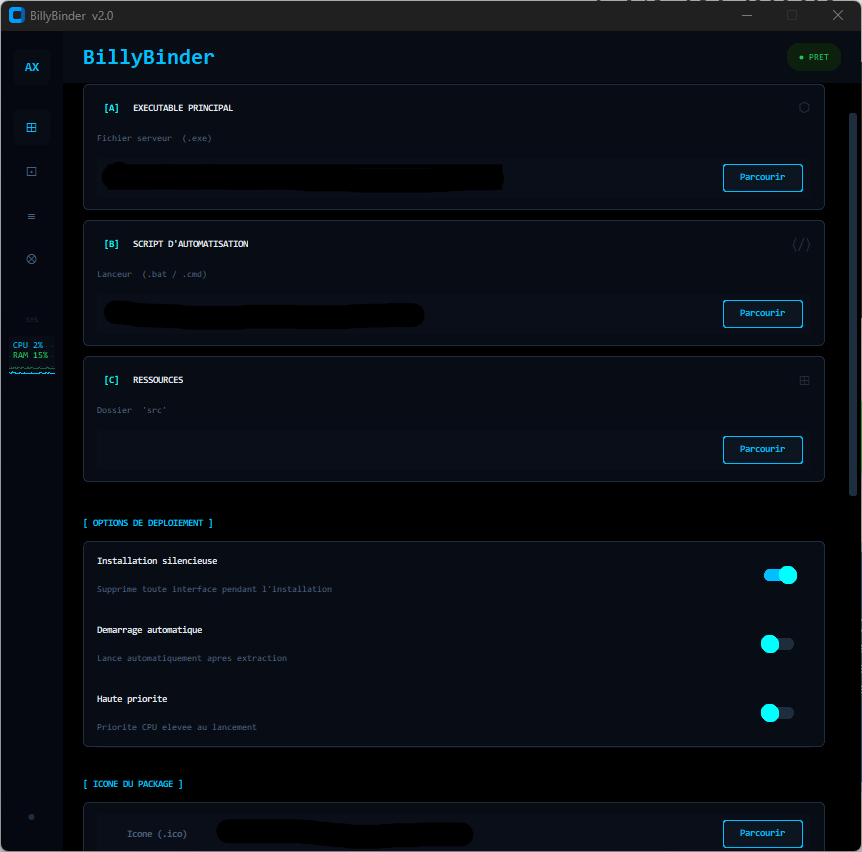
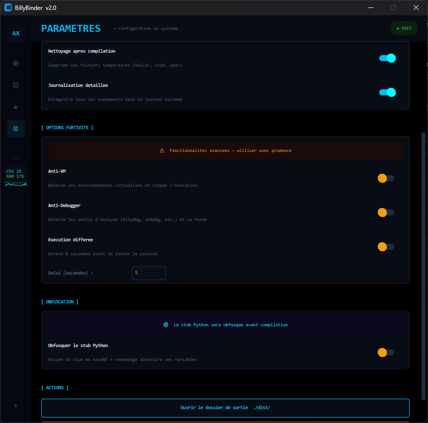

# 💀 BillyBinder v2.0 | Advanced Stealth Payload Hub

  
  
  

🌑 Overview
BillyBinder est un moteur de fusion binaire (Binder) de nouvelle génération. Conçu pour la discrétion totale, il permet d'agréger vos outils (RAT, Stealers, Keyloggers) dans des vecteurs d'apparence légitime (Leurres) tout en bypassant les analyses statiques des solutions de sécurité.

⚡ Caractéristiques Tactiques
🛡️ FUD Engine (Anti-AV/EDR)
Entropy Injection : Morphing de signature par injection de bruit AST (espaces fantômes et commentaires aléatoires) pour casser les hashs statiques.

Armor Shield : Intégration native de PyArmor pour une obfuscation de code source de niveau militaire.

🖇️ Deep Binding System
Fusion Multi-Couches : Combine un binaire principal, un script de diversion (Decoy) et un dossier de ressources complet (src).

Isolation UUID : Chaque build génère un environnement d'extraction unique et furtif dans les répertoires temporaires.

🖥️ Cyber-UI Dashboard
Terminal Matrix : Console de logs dynamique avec coloration syntaxique.

Real-time Monitoring : Suivi de l'utilisation CPU/RAM pendant les phases de build lourdes.

Project Persistence : Sauvegarde automatique des chemins et configurations.

🛠️ Installation & Setup
Cloner le projet :

Bash
git clone [https://github.com/votre-pseudo/BillyBinder.git](https://github.com/votre-pseudo/BillyBinder.git)
cd BillyBinder
Installer les dépendances :

Bash
pip install customtkinter pyarmor pyinstaller
Lancer l'interface :

Bash
python billy_binder.py
🚀 Workflow d'Utilisation
Core : Chargez votre binaire principal ou script.

Decoy : Sélectionnez votre fichier de couverture (installeur, doc, etc.).

Secure : Activez l'obfuscation et l'entropie dans l'onglet paramètres.

Compile : Cliquez sur GENERATE PACKAGE. Le résultat final se trouve dans le dossier /dist.

⚠️ Disclaimer
Cet outil est développé exclusivement à des fins de tests d'intrusion et d'éducation. L'utilisation de BillyBinder contre des cibles sans autorisation préalable est strictement illégale. L'auteur décline toute responsabilité quant à l'usage malveillant de ce logiciel.

"With great power comes great responsibility." 💀

  

  

